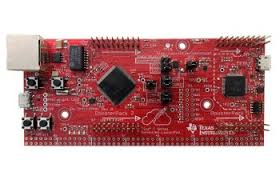

.. image:: nectar.png
   :scale: 40%
   :align: right

EK-TM4C1294XL
=============

The EK-TM4C1294XL is the backbone of the water quality sensor.
It handles all of the communication between the sensors and all
web applications. Running at a cool 120 MHz and including ethernet
capabilities, this MCU is the ideal candidate for this project.

----

This part can be purchased via the following link:
https://store.ti.com/tiva-connected-launchpad.aspx

----

*Up Next:*

.. toctree::
   :maxdepth: 1

   Sensors
   