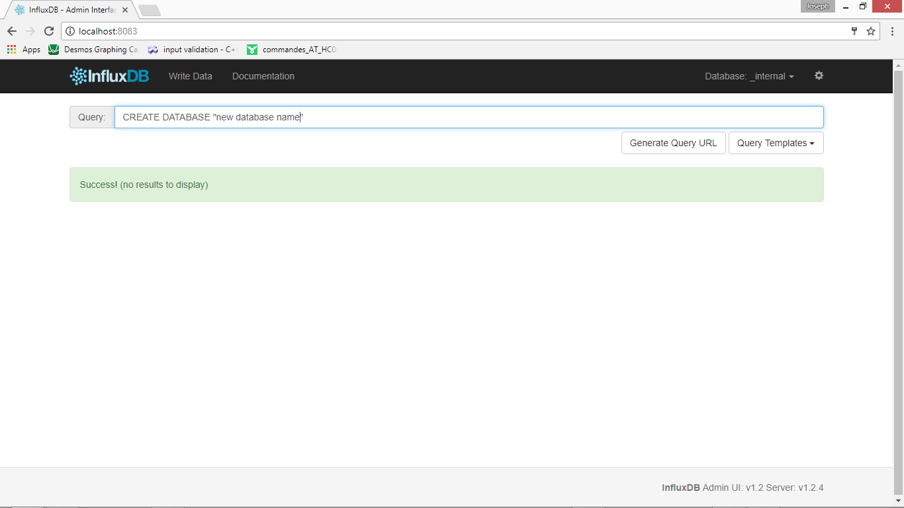

.. image:: nectar.png
   :scale: 40%
   :align: right

InfluxDB
========

InfluxDB is an open-source time series database. We will use this 
database as a medium for our sensor data. After the sensors are sampled, 
the values are sent to the custom named database until accessed again by
our graphical interface, Chronograf.

----

Below are the steps for setting up InfluxDB for windows users:

- Download InfluxDB dependencies :download:`here <../docs/influxdb-1.3.2-1.zip>`.

- unzip directory

- open start.cmd file

- open your default web browser and enter: 'localhost:8086'

- on the right, click **Query Templates** -> **Create Database**

- in the Query field, change db_name to the name of the database desired and press enter. You should see a message stating the successful creation of your database.

----

*Up Next:*

.. toctree::
   :maxdepth: 1

   chronograf