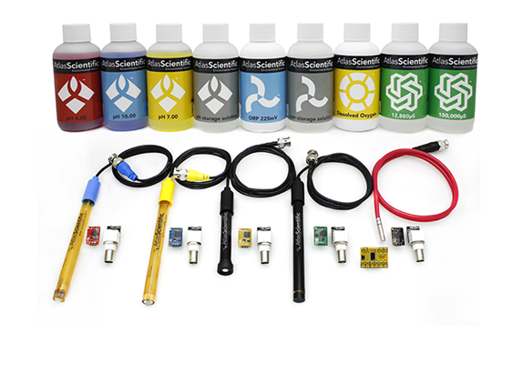

.. image:: nectar.png
   :scale: 40%
   :align: right

Sensors
=======

For this project we are using the Atlas Scientific 
ENV-SDS (Full Water Monitoring Kit). Featured in the kit is
a **temperature** sensor, **oxidation reduction potential** sensor,
**electrodonductivity** sensor, **dissolved oxygen** sensor and a **pH**
sensor.

----

These sensors can be purchased at the following link:
https://www.atlas-scientific.com/product_pages/kits/env-sds-kit.html

----

*Up Next:*

.. toctree::
   :maxdepth: 1

   router