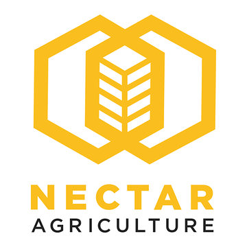

Building your project
=====================

Once all of the hardware is set up and the software is 
configured it is time to make a couple of changes before 
we build and run your project. Clone the project from github 
into the workspace chosen during CCS setup and import the project.
In the file named http.c, edit the HOSTNAME field to your LAN IP
address followed by **:8086**. To discover your LAN IP, enter ipconfig
into the cmd prompt if using windows, and ifconfig for linux.

.. image:: http.png

Change the database name to the name chosen for InfluxDB. In this example
we are using "mydb". Save, build and debug the project. Connect your MCU 
directly to your router via the included ethernet cable. Run your project. 
