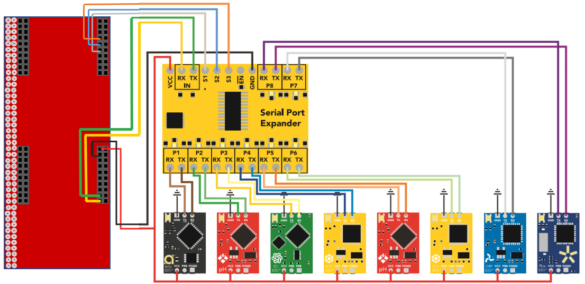
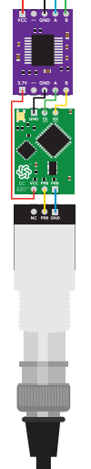

Circuitry
=========

----

MCU wiring
----------

Shown below is a diagram of how to connect the **EK-TM4C1294XL**
to the Atlas Scientific **8:1 Serial Port Expander**. 

Note that this diagram is not accurate for the **Oxidation
Reduction Potential**, **Electroconductivity**, **Dissolved
Oxygen**, and **pH** modules. Although the **Temperature** 
sensor can be directly connected, it is recommended to buffer
the other sensors to the **8:1 Serial Port Expander** with the
Atlas Scientific **Inline Voltage Isolators**.

Also, with the code provided, only five modlues will work at a
time and must be connected to ports 1-5 on the **Serial Port Expander**

----

EZO wiring
----------

The EZO's are wired between the ISO circuits and the BNC connectors. 
More information for wiring Atlas Scientific devices can be found at 
the given link: https://www.atlas-scientific.com

----

*Up Next:*

.. toctree::
   :maxdepth: 1

   build

