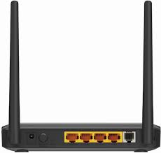

.. image:: nectar.png
   :scale: 40%
   :align: right

Router
======

The last bit of hardware needed for this project is a router to
connect directly to the EK-TM4C1294XL.

----

This ends the hardware introduction for the tutorial. Now to
introduce the software dependencies.

----

*Up Next:*

.. toctree::
   :maxdepth: 1

   CCS